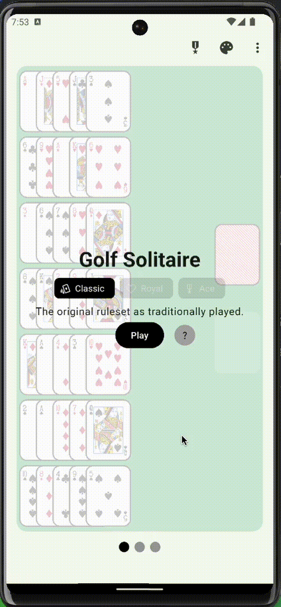
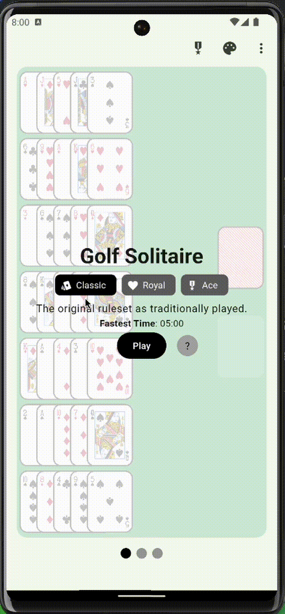

# Cards - A Flutter Card Game Collection

A collection of classic card games built with Flutter, featuring Golf Solitaire, Klondike Solitaire, Free Cell, and Spider Solitaire with progressive difficulty levels, achievements, and customization options.

## Features

| Feature                           | Description                                                                                                     | Preview                                                 |
|-----------------------------------|-----------------------------------------------------------------------------------------------------------------|---------------------------------------------------------|
| **Four Classic Card Games**       | • Golf Solitaire • Klondike Solitaire (Solitaire) • Free Cell • Spider Solitaire                      |                  |
| **Progressive Difficulty System** | • Easy (Traditional ruleset) • Medium (Moderate twist) • Hard (Expert modifiers)                          |      |
| **Interactive Tutorials**         | • Learn game mechanics with highlighted board elements • Step-by-step guidance for each game                 |            |
| **Achievement System**            | • Unlock new card back designs by completing challenges • Track fastest completion times for each difficulty |    |
| **Customization Options**         | • Custom card backs • Background themes                                                                      |  |
| **Cross-Platform Support**        | • Responsive design for phones, tablets, and desktops                                                           |    |

## Built With

- [Flutter](https://flutter.dev/)
- [card_game](https://pub.dev/packages/card_game) - A custom package for building card-based games

## Architecture

This project uses the [card_game](https://pub.dev/packages/card_game) package to handle:
- Card positioning and layouts
- Drag and drop mechanics
- Card flipping animations
- Game state management